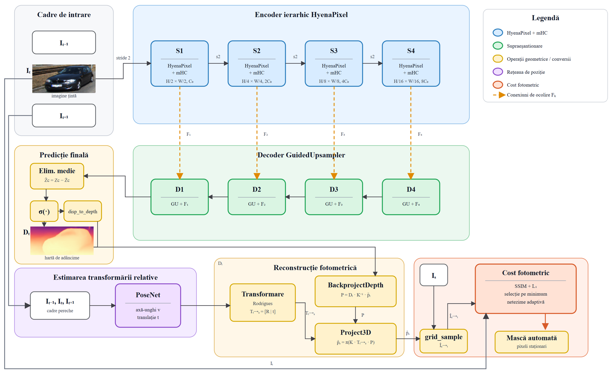
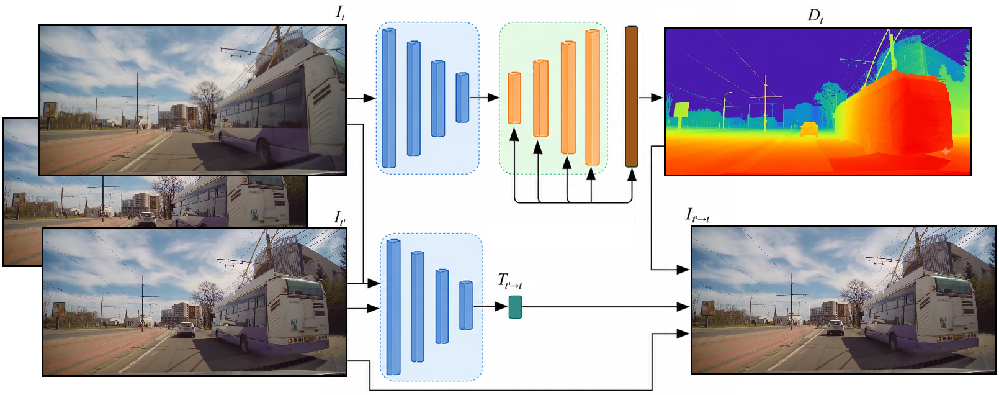

# HyenaDepth


## Introduction
This is the implementation of the *HyenaDepth: self-supervised monocular depth estimation model improvement using advanced matematical methods and guided upsampling*.
<br />
<br />



## Theoretical prerequisites
Fundamentally, self-supervised depth estimation is a form of Structure from Motion (SfM), where the monocular camera is moving within a rigid 
environment to provide multiple views of that scene. 

The seminal work in this field is "*Digging Into Self-Supervised Monocular Depth Estimation*" (https://arxiv.org/pdf/1806.01260.pdf) upon which 
almost every self-supervised depth estimation method/paper/repo is based on (also our repo).

- Let $I_t \in \mathbb{R}^{H \times W \times 3}, \ t \in \{-1, 0, 1\}$ be a frame in a monocular video sequence captured by a moving camera, where $t$ is the frame time index.

- Similarly, let $D_t \in \mathbb{R}^{H \times W}$ denote the depth map corresponding to image $I_t$.

- The camera pose changes from time $0$ to time $t$, $t \in \{-1, 1\}$ is encoded by the $3 \times 3$ rotation matrix $R_t$ and the translation vector $t_t$. We obtain the $4 \times 4$ camera transformation matrix thus:

$$
M_t =
\begin{bmatrix}
R_t & t_t \\
0 & 1
\end{bmatrix}
$$

Our aim is to train two CNN networks to simultaneously estimate the pose of the camera, and the structure of the scene respectively:

- $M_t = \Theta_{pose}(I_t)$
- $D_t = \Theta_{depth}(I_t)$

Self-supervised depth prediction reformulates the learning task as a novel view-synthesis problem.

Specifically, during training, we let the coupled network synthesise the photo-consistency appearance of a target frame from another viewpoint of the source frame. We treat the depth map as an intermediate variable to constrain the network to complete the image synthesis task.

- Let $(u, v) \in \mathbb{R}^2$ be the calibrated coordinates of a pixel in image $I_0$. In this case, let the origin $(0, 0)$ be the top-left of the image.

- In the process of imaging, a three-dimensional point $(X, Y, Z) \in \mathbb{R}^3$ projects onto $(u, v)$ through a perspective projection operator.

- Suppose that the transformation matrix $M_t$ encodes the pose change of the camera from time $0$ to time $t$ and the equation below is the perspective projection operator:

$$\pi(X,Y,Z) =\left(f_x \frac{X}{Z} + c_x,\ f_y \frac{Y}{Z} + c_y\right)=(u,v)$$

where $(f_x, f_y, c_x, c_y)$ are the camera intrinsic parameters.

- Therefore, given a depth map $D(u,v)$, a 2D image point $(u,v)$ backprojects to a 3D point $(X,Y,Z)$ through backprojection operator:

$$\pi^{-1}(u,v,D(u,v)) =D(u,v)\left(\frac{u - c_x}{f_x},\ \frac{v - c_y}{f_y},\ 1\right)=(X,Y,Z)$$

- Then the corresponding pixels in image $I_t$ can be computed as:

$$(u',v') =\pi\left(M_t \pi^{-1}(u,v,D(u,v))\right)=g(u,v \mid D(u,v), M_t)$$

- We project the pixels of an image to form a novel synthetic view, as shown in the equation above. However, the projected coordinates $(u',v')$ are continuous values. To obtain $I^S(u,v)$ we include a differentiable bilinear sampling mechanism, as proposed in spatial transformer networks.

- We can now linearly interpolate the values of the 4-pixel neighbours: top-left, top-right, bottom-left, bottom-right of $I(u',v')$ to give the RGB intensities as follows:

$$I^S(u,v) =\sum_u \sum_vw^{uv} I(u',v')$$

where $w^{uv}$ is linearly proportional to the spatial proximity between $(u,v)$ and $(u',v')$, and

$$
\sum_{u,v} w^{uv} = 1
$$

<br />
Self-supervised framework:


## Instalation
Requirements: `Ubuntu 20.04`, `NVIDIA GPU`, `CUDA >= 11.7`

You'll probably find useful this documentation [Cuda-installation-guide-Linux](https://docs.nvidia.com/cuda/cuda-installation-guide-linux/index.html#conda-installation) and also
this:
```bash
conda install cuda -c nvidia
```

First create a conda environment called **hyenadepth**:
```bash
conda create -n hyenadepth  python=3.10  
```

Activate the new enviroment:
```bash
conda activate hyenadepth
```

After that, run the following:
```bash
pip install -e .
```
or
```bash
pip install -e . && pip install -e ".[dev]"
```

Recommended to install the `[dev]` dependencies.

## KITTI training data
You can download the entire [raw KITTI dataset](https://www.cvlibs.net/datasets/kitti/raw_data.php) by running:
```bash
wget -i data/kitti/kitti_archives_to_download.txt -P data/kitti/kitti_data/
```
The **'-i'** option in wget stands for "input-file". <br />
This option specifies a file that contains a list of URLs to download.  <br />
In this case, the file is src/data/kitti/kitti_archives_to_download.txt.  <br />
This file should contain a list of URLs, each on a new line, pointing to the files that need to be downloaded. <br />

<br />

The **'-P'** option specifies the prefix (directory) where downloaded files will be saved. <br /> 
In this case, the files are being downloaded to the src/data/kitti/kitti_data/ directory. <br />

<br />
Then unzip with:

```bash
cd data/kitti/kitti_data
unzip "*.zip"
cd .. # 3 times
```
<br />

**Warning**: it weighs about 175GB, so make sure you have enough space to unzip too!
<br />

Their default settings expect that you have converted the png images to jpeg with this command, **which also deletes
the raw KITTI `.png` files**:
```bash
find data/kitti/kitti_data/ -name '*.png' | parallel 'convert -quality 92 -sampling-factor 2x2,1x1,1x1 {.}.png {.}.jpg && rm {}'
```
**or** you can skip this conversion step and train from raw png files by adding the flag `--png` when training, at the expense of slower load times.

The above conversion command creates images which match their experiments (see [Monodepth2](https://github.com/nianticlabs/monodepth2)), where KITTI `.png` images were converted to `.jpg` on Ubuntu 16.04 
with default chroma subsampling 2x2,1x1,1x1. They found that Ubuntu 18.04 defaults to 2x2,2x2,2x2, which gives different results, hence 
the explicit parameter in the conversion command.

## KITTI evaluation data

To prepare the ground truth depth maps, run the following command for your desired split:
```shell
# For Eigen split
python -m data.kitti.kitti_utils.export_gt_depth --data_path kitti_data --split eigen

# For Eigen Benchmark split
python -m data.kitti.kitti_utils.export_gt_depth --data_path kitti_data --split eigen_benchmark
```

This will generate `gt_depths.npz` files in the corresponding split directories (`data/kitti/kitti_splits/eigen/` or `data/kitti/kitti_splits/eigen_benchmark/`) containing the ground truth depth maps.

## Cityscapes evaluation data

### Download test images and camera files

To evaluate on Cityscapes, you need to download the test image sequences and camera calibration files from the [Cityscapes dataset website](https://www.cityscapes-dataset.com/downloads/):

1. **leftImg8bit_sequence_trainvaltest.zip** (324GB) **Warning: Very large file!**
2. **camera_trainvaltest.zip** (2MB)

After downloading, unzip both files under `data/cityscapes/`:

```bash
cd data/cityscapes
unzip leftImg8bit_sequence_trainvaltest.zip
unzip camera_trainvaltest.zip
cd ../..
```

**Optional - Save disk space**: Since we only need the test set for evaluation, you can delete the train and val folders:

```bash
rm -rf data/cityscapes/leftImg8bit_sequence/train
rm -rf data/cityscapes/leftImg8bit_sequence/val
rm -rf data/cityscapes/camera/train
rm -rf data/cityscapes/camera/val
```

**Further cleanup**: To keep only the 1525 test files needed for evaluation (saving ~87GB), use the cleanup script:

```bash
# First run in dry-run mode to preview what will be deleted
python3 -m data.cityscapes.cleanup_cityscapes --dataset_dir data/cityscapes --test_file_list data/cityscapes/cityscapes_test_files.txt --dry-run

# Then run the actual cleanup
python3 -m data.cityscapes.cleanup_cityscapes --dataset_dir data/cityscapes --test_file_list data/cityscapes/cityscapes_test_files.txt
```

### Expected directory structure

After extraction, your directory structure should look like this:

```
data/cityscapes/
├── leftImg8bit_sequence/
│   └── test/
│       ├── berlin/
│       ├── bielefeld/
│       ├── bonn/
│       └── ...
└── camera_trainvaltest/
    └── camera/
        └── test/
            ├── berlin/
            ├── bielefeld/
            ├── bonn/
            └── ...
```

### Download ground truth depth files

The ground truth depth files for Cityscapes can be found at [here](https://storage.googleapis.com/niantic-lon-static/research/manydepth/gt_depths_cityscapes.zip).
Download this and unzip into `data/cityscapes`.

## Make3D evaluation data

We use the Make3D test set for evaluating our method (zero-shot evaluation), which could be downloaded from [here](http://make3d.cs.cornell.edu/data.html).
Download this and unzip into `data/make3d`.

You need to download:
- **Test134 images**: The 134 test images (`.jpg` files)
- **Test134 depths**: The corresponding ground truth depth maps (`.mat` files)

Our evaluation uses all 134 images from the Make3D test set for zero-shot depth estimation evaluation.


## Inference

```bash
python -m src.inference.test  
```

## Evaluation

**Note**: All evaluation settings (model paths, model settings, evaluation settings, etc.) are configured in `src/config/config.yaml`.

### KITTI evaluation 


The KITTI evaluation pipeline processes each test image through the trained depth model, applies optional post-processing (left-right consistency check) and median scaling, then computes both error metrics (abs_rel, sq_rel, rmse, rmse_log) and accuracy metrics (δ<1.25, δ<1.25², δ<1.25³) by comparing predictions against ground truth depth maps.

```bash
python -m src.evaluation.kitti_evaluation
```

#### Verification of Evaluation Script

To verify the correctness of the KITTI evaluation implementation, you can compare results against those reported in the [Monodepth2 paper](https://arxiv.org/abs/1806.01260):

**Expected results with Monodepth2 (1024×320) on Eigen split** (monocular, no post-processing, with median scaling):
```
|  abs_rel |   sq_rel |     rmse | rmse_log |       a1 |       a2 |       a3 | 
|   0.115  |   0.884  |   4.700  |   0.190  |   0.879  |   0.961  |   0.982  |
```
*Reference: Table 1 (page 6) and Table 7 (page 14) of the Monodepth2 paper*

**Expected results with Monodepth2 (640×192) on Eigen Benchmark split** (monocular, no post-processing, with median scaling):
```
|  abs_rel |   sq_rel |     rmse | rmse_log |       a1 |       a2 |       a3 | 
|   0.090  |   0.545  |   3.945  |   0.137  |   0.914  |   0.983  |   0.995  |
```
*Reference: Table 7 (page 14) of the Monodepth2 paper*

*Note: Results may vary slightly depending on environment and library versions. Metrics correspond to evaluating each model at its training resolution.*

### Cityscapes zero-shot evaluation


The Cityscapes zero-shot evaluation demonstrates the model's generalization capability by testing on urban driving scenes without any fine-tuning. The pipeline follows the same structure as KITTI evaluation but operates on Cityscapes' diverse city environments.

```bash
python -m src.evaluation.cityscapes_evaluation
```

### Make3D zero-shot evaluation


The Make3D zero-shot evaluation tests the model on outdoor scenes with different characteristics than KITTI. This evaluation only computes error metrics (abs_rel, sq_rel, rmse, rmse_log) as the Make3D dataset focuses on absolute depth accuracy rather than relative accuracy thresholds.

```bash
python -m src.evaluation.make3d_evaluation
```

#### Verification of Evaluation Script

To verify the correctness of the Make3D evaluation implementation, you can compare results against those reported in the [Monodepth2 paper](https://arxiv.org/abs/1806.01260):

**Expected results with Monodepth2 (640×192)**:
```
|  abs_rel |   sq_rel |     rmse | rmse_log | 
|    0.321 |    3.377 |    7.252 |    0.375 | 
```
*Reference: Table 3 (page 7) of the Monodepth2 paper*

*Note: Results may vary slightly depending on environment and library versions. Metrics correspond to evaluating the model at its training resolution.*

## Training

All training parameters (model architecture, learning rate, batch size, etc.) are configured in `src/config/config.yaml`.

### Standard Training (Photometric Loss Only)

To start standard self-supervised depth training, run:
```bash
python -m src.train.trainer
```
## Evaluation Results

### On KITTI Dataset
| Model | Train Type | No. of params. | AbsRel ↓ | SqRel ↓ | RMSE ↓ | RMSElog ↓ | $\delta < 1.25$ ↑ | $\delta < 1.25^2$ ↑ | $\delta < 1.25^3$ ↑ |
|---|---:|---:|---:|---:|---:|---:|---:|---:|---:|
| MonoDepth2 | M | 34M | 0.090 | 0.545 | 4.642 | 0.060 | 0.883 | 0.962 | 0.982 |
| CaDepth-Net | M | 58M | 0.095 | 0.569 | 4.535 | 0.081 | 0.892 | 0.964 | 0.983 |
| PackNet-SfM | M | 128M | 0.097 | 0.585 | 5.612 | 0.085 | 0.887 | 0.962 | 0.982 |
| HR-Depth | M | 14M | 0.099 | 0.592 | 4.632 | 0.085 | 0.884 | 0.962 | 0.983 |
| Lite-Mono | M | 8M | 0.097 | 0.565 | 4.561 | 0.083 | 0.886 | 0.963 | 0.983 |
| DynamicDepth | M | - | 0.096 | 0.540 | 4.458 | 0.075 | 0.897 | 0.964 | 0.984 |
| MonoViT | M | 27M | 0.089 | 0.608 | 4.372 | 0.075 | 0.900 | 0.967 | 0.984 |
| MambaDepth | M | 30M | 0.087 | 0.536 | 4.370 | 0.072 | 0.907 | 0.970 | 0.986 |
| **HyenaDepth (propus)** | **M** | **29M** | **0.085** | **0.530** | **3.732** | **0.052** | **0.928** | **0.987** | **0.996** |

### On Cityscapes Dataset
| Model | Train Type | No. of params. | AbsRel ↓ | SqRel ↓ | RMSE ↓ | RMSElog ↓ | $\delta < 1.25$ ↑ | $\delta < 1.25^2$ ↑ | $\delta < 1.25^3$ ↑ |
|---|---:|---:|---:|---:|---:|---:|---:|---:|---:|
| MonoDepth2 | MS | 34M | 0.163 | 1.883 | 8.967 | 0.105 | 0.757 | 0.922 | 0.974 |
| Struct2Depth 2 | M | - | 0.145 | 1.737 | 7.280 | 0.205 | 0.813 | 0.942 | 0.976 |
| ManyDepth | MS | 37M | 0.114 | 1.193 | **6.223** | 0.170 | 0.875 | 0.967 | 0.989 |
| MambaDepth | M | 30M | **0.112** | **1.186** | 6.226 | 0.167 | **0.876** | **0.968** | 0.990 |
| **HyenaDepth (propus)** | **M** | **29M** | 0.139 | 1.423 | 7.151 | **0.082** | 0.853 | 0.965 | **0.991** |

### On Make3D Dataset
| Modelul | AbsRel ↓ | SqRel ↓ | RMSE ↓ | RMSElog ↓ |
|---|---:|---:|---:|---:|
| MonoDepth2 | 0.322 | 3.589 | 7.417 | 0.163 |
| Zhou | 0.383 | 5.321 | 10.470 | 0.478 |
| DDVO | 0.387 | 4.720 | 8.090 | 0.204 |
| CADepth-Net | 0.312 | 3.086 | 7.066 | 0.159 |
| MambaDepth | 0.307 | **2.405** | 6.858 | 0.153 |
| **HyenaDepth (propus)** | **0.284** | 2.625 | **6.485** | **0.142** |
## Local overfit

The goal was to see if the HyenaDepth architecture could be overfit on a small batch of samples—typically one, two, or five images.
The ability to overfit is a test for model capacity, and visual aids, such as the rendering of predicted depth maps, were instrumental in evaluating the success. 
If overfitting was achieved with satisfactory visual confirmation, the next logical step involved deploying the entire training pipeline, utilizing the full dataset.
```bash
python -m src.overfit.local_trainer
```

## Jupyter notebooks

You can also find some useful jupyter notebooks which have the purpose of illustrating the functionality of main parts of this project.